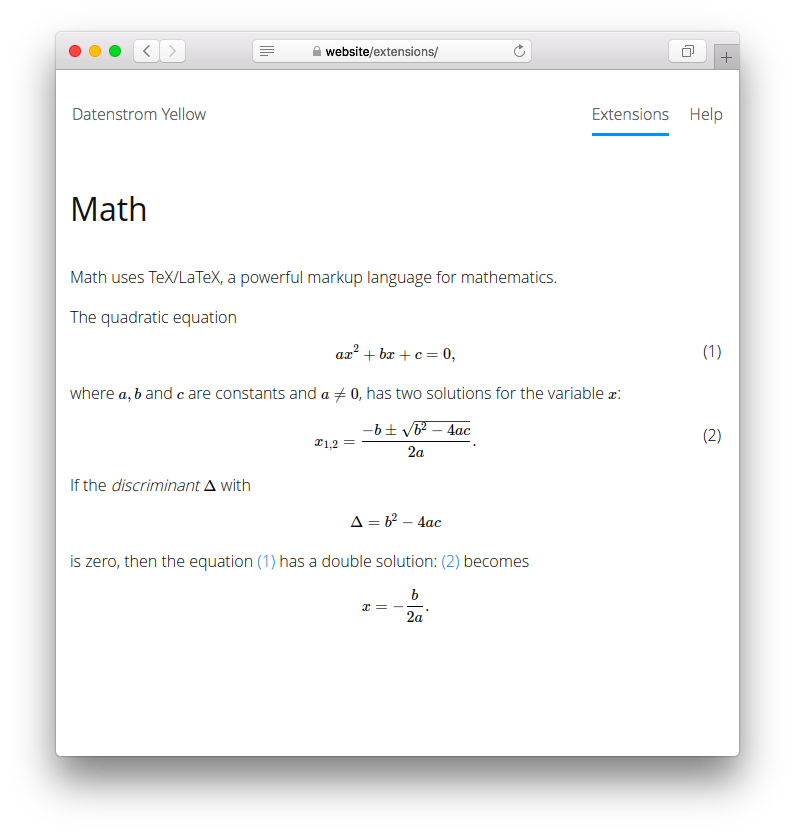

# Math 0.9.2

Mathematical expressions with TeX/LaTeX.

<p align="center"></p>

## How to install an extension

[Download ZIP file](https://github.com/GiovanniSalmeri/yellow-math/archive/refs/heads/main.zip) and copy it into your `system/extensions` folder. [Learn more about extensions](https://github.com/annaesvensson/yellow-update).

## How to show a mathematical expression

With this extension you can write mathematical expressions with Tex/LaTeX. [TeX/LaTeX](https://en.wikibooks.org/wiki/LaTeX/Mathematics) is a rich and specialised system for writing mathematics. [KaTeX](https://katex.org/docs/supported.html) is used for rendering the expressions.

The first option is to write a mathematical expression with a shortcut. Create a `[math]` shortcut. Wrap the whole expression in quotes if there are spaces or quotes. Inside the expression use `%|` instead of `]`, and `""` instead of `"`.

The second option is to write a mathematical expression with a code block. Wrap the whole expression in `` ``` `` and add the identifier `math`.

## Examples

An expression with a shortcut:

    [math x=\frac{-b\pm\sqrt{b^2-4ac}}{2a}]

An expression with a code block:

    ``` math
    \Re{z} =\frac{n\pi \dfrac{\theta +\psi}{2}}{
    \left(\dfrac{\theta +\psi}{2}\right)^2 + \left( \dfrac{1}{2}
    \log \left\lvert\dfrac{B}{A}\right\rvert\right)^2}.
    ```

## Acknowledgements

The extension includes [KaTeX 0.16.10](https://github.com/KaTeX/KaTeX) by Emily Eisenberg, Sophie Alpert and other. Thank you for the good work.

## Developer

Giovanni Salmeri. [Get help](https://datenstrom.se/yellow/help/).
